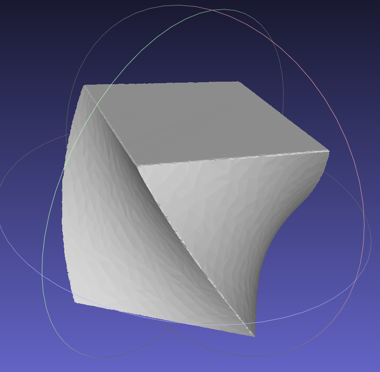

# Implicit-SDF-Planner


**Related Paper**: 

Please cite the paper below if this repo helps you.

- [Continuous Implicit SDF Based Any-shape Robot Trajectory Optimization](https://arxiv.org/abs/2303.01330), Tingrui Zhang*, Jingping Wang*,Chao Xu, Alan Gao, Fei Gao.
- Our paper is accepted at IROS2023, and we will release some of our code around the end of July.


* [Video on Youtube](https://www.youtube.com/watch?v=Sb6HaVMZWak&ab_channel=FeiGao) or [Video on Bilibili](https://www.bilibili.com/video/BV1Rg4y1E79w/?spm_id_from=333.999.0.0)

<a href="https://www.youtube.com/watch?v=Sb6HaVMZWak&ab_channel=FeiGao" target="blank">
  <p align="center">
    
  </p>
</a>

## Demos supported by our pipeline

- Some of the demos are our **further work** after the IROS conference, and a more general pipeline for whole-body planning of arbitrarily shaped robots with **Continuous Collision Safety Certification** is on the way.
  
  #### Arbitrarily shaped robots fly over three consecutive narrow slits (with quadrotor dynamics)
  
  <div align="center">
  
  
  </div>
  <br>
  <div align="center">
  
  
  </div>

#### Arbitrarily shaped robots traverse the random map (with rotation decoupled from translation)

<div align="center">
  
  
</div>
<br>
<div align="center">
  
  
</div>

#### Continuous Collision Avoidance with Safety Certification (with rotation decoupled from translation)

<div align="center">
  
</div>
<br>
<div align="center">
  
</div>

#### Obstacle avoidance planning for shape variant robots (with quadrotor dynamics)

<div align="center">
  
</div>
<br>
<div align="center">
  
</div>

Compiling tests passed on ubuntu 20.04 with ros installed. You can just execute the following commands one by one.

## Qucik Start

```sh
echo "alias python=python3" >> ~/.zshrc  #(If use zsh) 
echo "alias python=python3" >> ~/.bashrc #(If use bash)
python3 -m pip3 install pygame==2.0.0.dev12 
sudo apt-get install gcc g++ make gfortran cmake libomp-dev
git clone https://github.com/ZJU-FAST-Lab/Implicit-SDF-Planner.git
cd Implicit-SDF-Planner
./build.sh
source devel/setup.bash #(If use bash)
source devel/setup.zsh  #(If use zsh) 
roslaunch ego_planner demox.launch #(x=1,2,3...)
```

- Then use "3D Nav Goal" in rviz to publish the goal for  navigation.
**Note that the start and end points of the clicks must be within the map.**
## More Examples (Some-shaped robots with uav dynamics)

### 2D version and shape variant demos will be released later...

### 3D version demos

Have a cool example? Submit a PR! You can either extend the robot's shape arbitrarily via an obj file in [shapes](src/plan_manager/shapes).The code will automatically use libigl to get its SDF. Or you can inherit from Generalshape in [Shape.hpp](src/utils/include/utils/Shape.hpp) to implement the desired shape and the associated SDF methods.For visualization purpose, you will also need a corresponding obj file for robot shape. 


<div style="display: flex; justify-content: center;">
  <table>
    <tr>
      <td></td>
      <td></td>
      <td></td>
      <td></td>
    </tr>
    <tr>
      <td></td>
      <td></td>
      <td></td>
      <td></td>
    </tr>
    <tr>
      <td></td>
      <td></td>
      <td></td>
      <td></td>
    </tr>
    <tr>
      <td></td>
      <td></td>
      <td></td>
      <td></td>
    </tr>
  </table>
</div>

## Acknowledgements

**There are several important works which support this project:**

- [GCOPTER](https://github.com/ZJU-FAST-Lab/GCOPTER): An efficient and versatile multicopter trajectory optimizer built upon a novel sparse trajectory representation named [MINCO](https://arxiv.org/pdf/2103.00190v2.pdf).
- [Swept-Volume](https://github.com/sgsellan/swept-volumes): For visualization purpose in our project.
- [LMBM](https://github.com/ZJU-FAST-Lab/LMBM):  Limited Memory Bundle Method for nonsmooth-optimization in our project.

## Licence

The source code is released under [GPLv3](http://www.gnu.org/licenses/) license.

## Maintaince

For any technical issue or bug, please contact Tingrui Zhang (tingruizhang@zju.edu.cn) or Jingping Wang (22232111@zju.edu.cn).
For commercial inquiries, please contact [Fei GAO](http://zju-fast.com/fei-gao/) (fgaoaa@zju.edu.cn).
